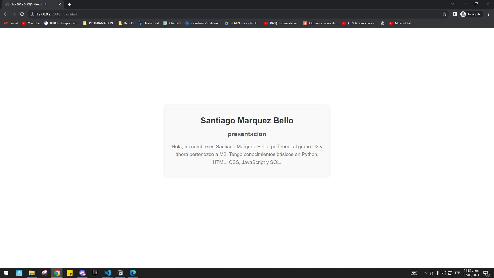

## Table of Contents
1. [General Info](#general-info)
2. [Technologies](#technologies)
3. [Installation](#installation)
4. [Collaboration](#collaboration)
5. [FAQs](#faqs)
### General Info
***
Write general information about your project. It is worth always putting the project status in the Readme file. This is where you can add it. You can also put the address of the project and why it is being done.
### Screenshot

In this area you can place screeshots that show the page or program.
## Technologies
***
A list of technologies used within the project:
* [Technologie name](https://example.com): Version 12.3 
* [Technologie name](https://example.com): Version 2.34
* [Library name](https://example.com): Version 1234
## Installation
***
A little intro about the installation. 
```
$ git clone https://example.com
$ cd ../path/to/the/file
$ npm install
$ npm start
```
Side information: To use the application in a special environment use ```lorem ipsum``` to start
## Collaboration
***
Give instructions on how to collaborate with your project.

## FAQs
***
A list of frequently asked questions


## Autor ✒️
Here you can put all the authors of the project 

⌨️ whit ❤️ by [Santiago24x](https://github.com/Santiago24x) 🤙